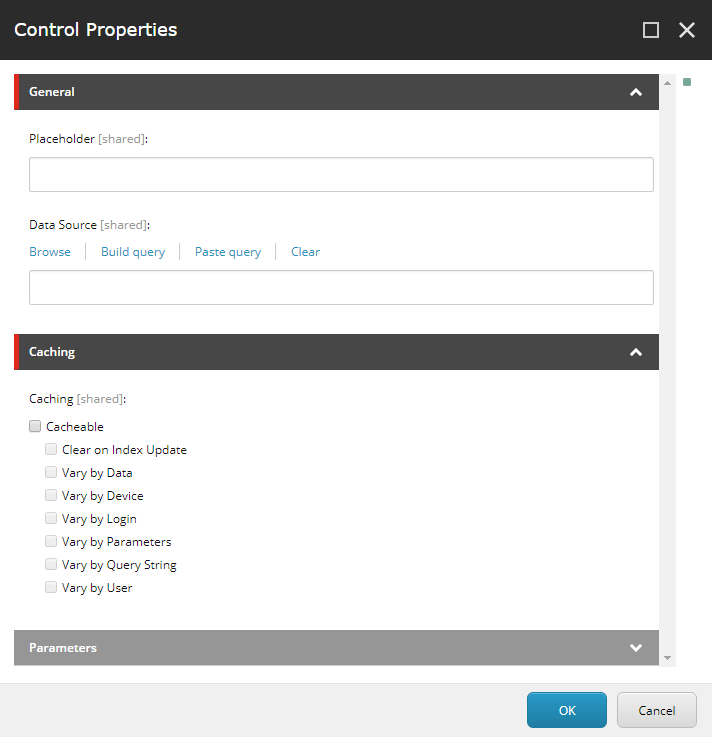
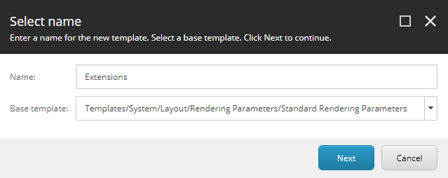
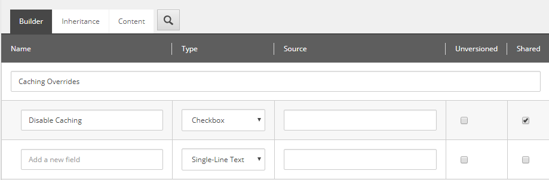
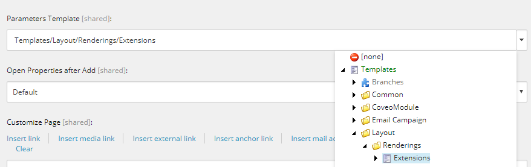
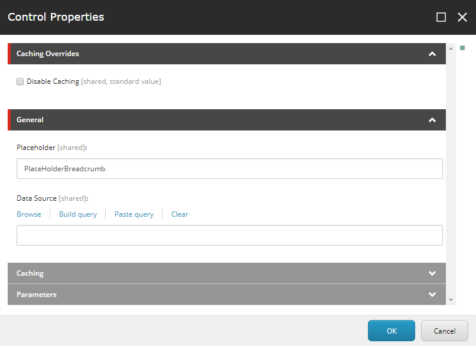

<!-- start:abstract -->

I've always been amazed by how configurable and extensible Sitecore is. Every time 
I think I'm taming the beast, Sitecore just looks at me, smiles and reminds me 
I know nothing... In other words, Sitecore keeps me humble...  

This week I learned it is possible to have a more granular control over a rendering 
inside the presentation layer using a combination of `parameter templates` and 
the `mvc.renderRendering` pipeline. In my case I was looking for a way to invalidate 
the rendering's cache, but I only wanted to do it for specific pages while keeping 
the others intact. Thankfully, this combination was just what I needed.  

<!-- end:abstract -->

### Parameter templates and the Control Properties window

Parameter templates can be used to add new `presentation properties` to a rendering. 
These presentation properties can be updated in the `control properties` window which 
is accessible from both the `Presentation/Details` menu and the `Experience Editor`, 
so no matter what your preference is you can still make use of this.  

The control properties window
  

One thing worth noting is that any change to the value of the properties made in this 
window will only affect the active rendering (in other words, the instance of the rendering 
being updated), so even if the page has two or more of instances of the same rendering, only 
one will be updated. This gives us an excellent customization point.  

### Creating parameter templates

Parameter templates are treated like any other template in Sitecore, and while there 
is nothing stopping us from creating them in a different node, it is common to stored 
them along other templates under the `sitecore\Templates` node.  

One key difference between a parameter template and a other types of templates is the base 
they inherit from. The former inherits from the `Standard Rendering Parameters` template; 
the latter from the `Standard Values` template. So don't forget to update the `Base Template` 
property in the create wizard dialog.  
  

Template creation showing the standard rendering parameters
  

Now that we have our new parameter template, we can add sections and properties to it. 
Use the template builder as you would for any other template.  

Template customization
  

### Linking a parameter template to a rendering 

Linking a parameter template to a rendering is as simple as selecting the rendering from 
the content tree and updating the `Parameters Template` property value in the content panel.  

Use the Parameters Template to specify the desired template
  

### Customizing the rendering in the presentation layer

Once these two have been linked together, we can simply drop the new rendering in any page 
(or component with a presentation layer) and use the control properties window to update the 
values defined in the parameter template.  

Page setup
  

### Last, but not least... the pipeline

The pipeline is where the magic really happens. The `mvc.renderRendering` pipeline is used by 
Sitecore to execute renderers. It's conformed by a set of processes that will take care of the 
entire rendering process for us. The pipeline is called multiple times in a single request 
(once per rendering) and it provides an excellent way to introduce customization logic for the 
renderings. In my case, I'm reading the `Disable Caching` property to determine whether the 
rendering should set its cacheability property or not (in which case the cache gets invalidated 
and a fresh copy of the rendering is returned).  

Here is the code for the pipeline 
`gist:053e37fcb2137d82b7a8821ef972c73e?file=pipeline.cs`  

And here is the config patch file  
`gist:053e37fcb2137d82b7a8821ef972c73e?file=Z.MyCustom.Assembly.Caching.config`  

Hope this helps!