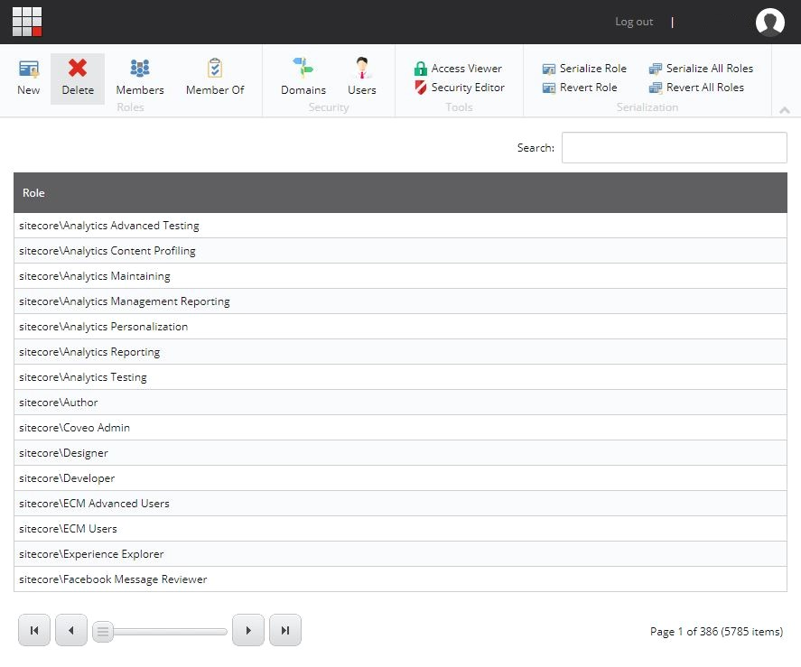
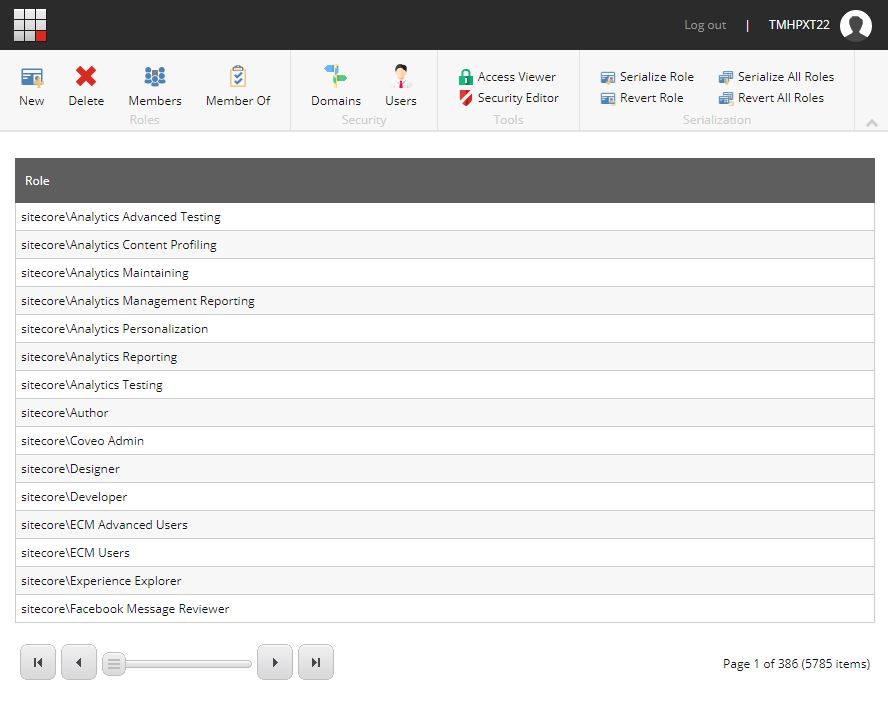
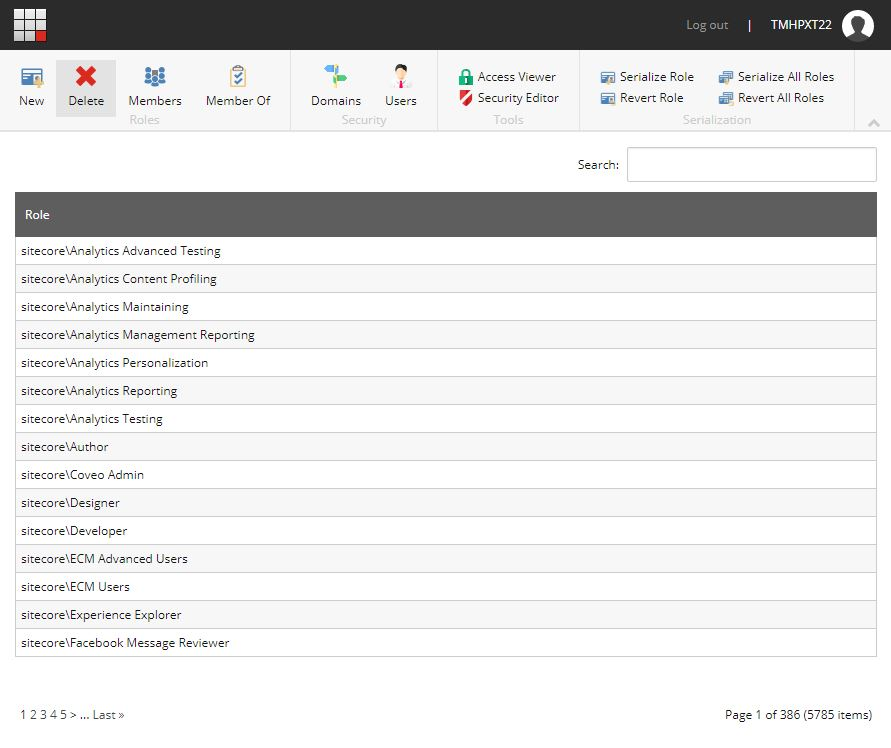

<!-- start:abstract -->

In Sitecore, roles are the preferred way of managing access to resources. 
The beauty of roles lies in their ability to shield the administrators from the 
complexities of security and user management, so instead of spending hours setting 
up individual accounts with specific rights and remembering these combinations, 
administrators can simply create a role, define the level of access and start 
adding users, groups, or even other roles to it. Simple and effective.  

The preferred tool for the job is the `Role Manager` screen (see below). 
Unfortunately, this tool is far from perfect... so let's do something about it.

<!-- end:abstract -->

Role Manager
  

The first thing you will notice is that sorting is disabled (the cursor changing 
from `default` to `pointer` gives it away). Perhaps this was done on purpose, trying 
to encourage users to use of the search bar instead of doing manual searches; 
perhaps it was an oversight. I honestly don't know... What I do know is that 
there are times when people don't really know the specific role they are looking for, 
but they at least know the domain in which the role was defined. In this type of 
scenarios sorting proves to be an excellent way of finding the required information.  

Depending on the desired options, customizing the `Role Manager` will require one 
or more updates to one of the Sitecore core files (files that come with Sitecore 
out of the box).  

> **Pro Tip**
> 
> Messing around with core files is not recommended, so take the necessary precautions.  
> I would recommend creating backups of all files before proceeding.  

The file in question is: `<Sitecore_Instance>\Website\sitecore\shell\Applications\Security\RoleManager\RoleManager.aspx`   

### Re-enabling sorting  

Re-enabling sorting is as easy as setting the property `AllowSorting` to `true`. 
This property is defined independently per column and can be found in the 
`Grid\Levels\GridLevel\Columns` node definition (see below).  

`gist:301627a873e217f8900b155343e135bc?file=1.aspx&highlights=10`  

### Show/Hide the search bar

Another easy one... the property `ShowSearchBox` in `Grid` will show the search box 
when its value is set to `true` and will do the opposite when set to `false`.  

`gist:301627a873e217f8900b155343e135bc?file=2.aspx&highlights=4-6`  

And the end result...  

### Change the pager style

Customizing the pager requires a little more effort (but not a lot). The final 
style and behavior of the pager will depend on a combination of settings and 
styles. Of all the available settings the most important is perhaps the `PagerStyle`. 

The `PagerStyle` will determine the type of pager to be used. Valid options for 
this property are `Slider` (default), `Numbered` (see image below) and `Buttons` 
(the buttons from `Slider` minus the slider). There are a bunch of other properties 
that don't seem to have any effect on the final output, I think most of the styling 
is controlled via the `Grid.css` stylesheet (which of course can be extended).  

`gist:301627a873e217f8900b155343e135bc?file=3.aspx&highlights=4-11`  

And the end result...

### Final thoughts

There are a lot more things that can be customized in the tool, some might not 
make a lot of sense (like completely hiding the header), but others will definitely 
improve the overall user experience.  

What else do you think is missing or would you like to see in this tool?
