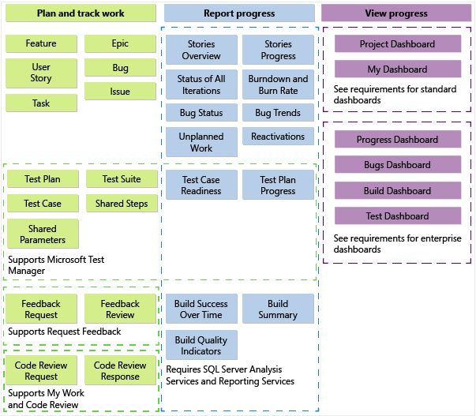
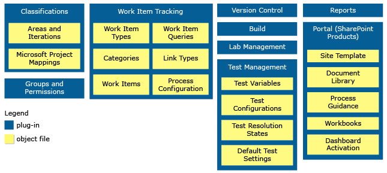
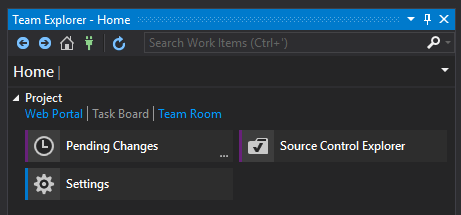
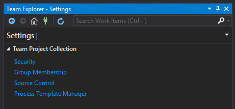
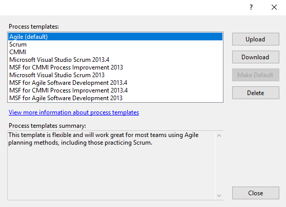

<!-- start:abstract -->

We have methodologies, we have processes, we have policies... all of them aiming 
at standardizing the way we work, and yet, even within the same company, no 
two teams do things in the exact same way. Everybody has a personal preference, 
that's what makes us unique.   

So, if we are intrinsically uniques, wouldn't it be nice to have tools that adapt 
to our every need instead of forcing us to do things in a certain way? Guys at 
[Microsoft](https://www.microsoft.com) certainly think so and that's why they 
made [TFS](https://visualstudio.microsoft.com/tfs/) and 
[VSTS](https://visualstudio.microsoft.com/team-services/) highly customizable.  

In this post I'm going to cover the essentials that will allow you and your team 
to customize your TFS instance using nothing more than your favorite text 
editor and a simple set of commands.  

<!-- end:abstract -->


### The Process Model

A process model defines all the artifacts (objects and processes) available to 
you when you create a team project. It contains all the valid type of items, 
fields, and values you can use to capture requirements and track your work (time, 
effort, etc).  


<center style="margin-top: -10px; margin-bottom: 20px"><span style="font-size: 10px;">Process Model Artifacts</span></center>

TFS and VSTS support three main process models: `Agile`, `Scrum`, and `CMMI`. Other 
process models may be created, but they all need to inherit from one of the main 
process models.  


<center style="margin-top: -10px; margin-bottom: 20px"><span style="font-size: 10px;">Process Template Plug-ins</span></center>

In TFS, the type of items supported by each model are defined via `type definitions`, 
and the fields and values via `layouts`. Both are stored in XML Definition Files 
that can be easily downloaded, updated, and uploaded back into TFS, thus making 
the models highly customizable.  

The whole process was revamped with the introduction of VSTS. Now is as simple as 
creating your own process model by extending one of the main models, and using 
the provided user interface to do changes to it. This is great for people that 
don't want to spend a lot of time customizing the process template, but still 
would like to do changes here and tehre. It's so simple, that I'm going to 
leave it out...  


### Download the entire process model definition

Use this approach if you are planning on creating your own process model, but 
you still want to base it from an existing one.    
Note: This is considered a best practice.

1. Open Visual Studio
2. Connect to your TFS instance using Team Explorer.
3. Once connected, go to Settings in the Home tab.  


4. Select Process Template Manager under Team Project Collection.  


5. Select the template to download.   



### ... or download just the type definition you want to update

Use this approach if you want to make updates to a specific type definition. 
With this, you are basically cherry picking the artifacts you want to change.  

> **Best Practice**
> 
> Instead of modifying any of the pre-existing process models, create your own 
> by means of inheritance and do your customizations there.   
> This makes it exportable and more manageable. 

1. Open a PowerShell prompt.
2. Load the required tooling (`witadmin`) by adding the Team Explorer folder to your `Path`.
```powershell
$env:Path += "$env:Path;${env:ProgramFiles(x86)}\Microsoft Visual Studio\2017\Enterprise\Common7\IDE\CommonExtensions\Microsoft\TeamFoundation\Team Explorer"
```

1. Export the type definition you want to update.
```powershell
witadmin exportwitd /collection:"<your_collection>" /p:"<your_project>" /n:"<type_definition>" /f:"<you_local_path_to_file>"
```

### Customizing type definitions

Type definitions are located in the `<Process_Model>\WorkItem Tracking\TypeDefinitions` 
folder (in case you have downloaded the entire process model) and they all have the same 
structure.  

```xml
<Witd:WITD>

  <!-- Identifies the work item -->
  <WORKITEMTYPE>

    <!-- Describes the work item  -->
    <DESCRIPTION></DESCRIPTION>

    <!-- Defines the work item fields -->
    <FIELDS></FIELDS>

    <!-- Defines the workflows followed by the work item -->
    <WORKFLOW></WORKFLOW>

    <!-- Defines the UI of the work item -->
    <FORM></FORM>

  </WORKITEMTYPE>

</Witd:WITD>
```

#### Updating the fields

Fields are used as the backing store of the item. This doesn't mean in any way 
that every single field is available to the user, some fields are calculated on 
the fly when another field changes its value, others are used as control values, 
and of course, there are fields that map directly to a control in the UI.  

Adding, removing and updating fields is as simple as adding, removing and 
updating the corresponding `<FIELD>` nodes under `<FIELDS>`. So I won't waste time 
explaining this, instead I will show how to accomplish some common tasks related to fields.  

- Add help text.  
Use `<HELPTEXT>` to provide a nice tool tip.  
```xml
...
  <FIELDS>
    <FIELD name="Priority" refname="Microsoft.VSTS.Common.Priority" type="Integer" reportable="dimension">
      <HELPTEXT>Importance to business</HELPTEXT>
    </FIELD>
  </FIELDS>
...
```

- Make it required
Use `<REQUIRED />` to mark the field as required.  
```xml
...
  <FIELDS>
    <FIELD name="Title" refname="System.Title" type="String" reportable="dimension">
      <REQUIRED />
    </FIELD>
  </FIELDS>
...
```

- Make it readonly
Use `<READONLY />` to mark the field as readonly.  
```xml
...
  <FIELDS>
    <FIELD name="Closed Date" refname="Microsoft.VSTS.Common.ClosedDate" type="DateTime" reportable="dimension">
      <REQUIRED />
    </FIELD>
  </FIELDS>
...
```

- Make it depend on a different field
Use `<WHENCHANGED field="<field_name>">` or `<WHENNOTCHANGED field="<field_name>">` 
to make the field depend on the presence or abscense of another field's value.  
```xml
...
  <FIELDS>
    <FIELD name="State Change Date" refname="Microsoft.VSTS.Common.StateChangeDate" type="DateTime">
      <!-- Set the current time when State changes -->
      <WHENCHANGED field="System.State">
        <SERVERDEFAULT from="clock" />
      </WHENCHANGED>

      <!-- Make the field readonly if State hasn't changed from the original value -->
      <WHENNOTCHANGED field="System.State">
        <READONLY />
      </WHENNOTCHANGED>
    </FIELD>
  </FIELDS>
...
```

#### Updating the workflows

Items are treated as state machines. So workflows are state machine operations 
that describe the item at any specific point in time.   

This section can be divided into two main sub-sections: `States` and `Transtions`.  

A `state` describes the characteristics of the item at a particular point in time. 
It's mostly used to calculate field values and apply validations (make a field 
readonly or required).  

```xml
...
  <STATE value="Done">
    <FIELDS>
      <!-- Clears the Remaining Work field when the state is Done -->
      <FIELD refname="Microsoft.VSTS.Scheduling.RemainingWork">
        <EMPTY />
      </FIELD>
      
      <!-- Marks Closed Date as required and sets the value to the current date/time -->
      <FIELD refname="Microsoft.VSTS.Common.ClosedDate">
        <REQUIRED />
        <SERVERDEFAULT from="clock" />
      </FIELD>
    </FIELDS>
  </STATE>
...
```

A `transition` describes the actions taken when an item transitions from one state 
to another. It's used mostly to update field values (i.e. populate lists based on 
the state of the item), but can be also be used to calculate field values, although 
this is usually done at the state level, because of the number of transitions that 
could lead to a particular state.

```xml
...
  <TRANSITION from="" value="New">
    <REASONS>
      <REASON value="Build Failure">
      <DEFAULTREASON value="New defect reported" />
    </REASONS>
  </STATE>
...
```

So, if I would like to add a new state, I would do something like:  

```xml
...
  <WORKFLOW>
    ...
    <STATE value="Waiting Verification">
      <!-- Updates the value of the Activity field to Testing -->
      <FIELD refname="Microsoft.VSTS.Common.Activity">
        <COPY from="value" value="Testing">
      </FIELD>
    </STATE>
    ...
    <TRANSITIONS>
      <TRANSITION from="In Progress" to="Waiting Verification">
        <REASONS>
          <DEFAULTREASON value="Development finished" />
        </REASONS>
      </TRANSITION>
      <TRANSITION from="Waiting Verification" to="In Progress">
        <REASONS>
          <DEFAULTREASON value="Needs fixing" />
        </REASONS>
      </TRANSITION>
      <TRANSITION from="Waiting Verification" to="Done">
        <REASONS>
          <DEFAULTREASON value="Reviewed" />
        </REASONS>
      </TRANSITION>
    </TRANSITIONS>
  </WORKFLOW>
...
```

#### Updating the UI

This is probably the section that will contain the most configurations, but it all 
will depend on the number of layouts you are planning to support (web, desktop, 
mobile, etc).  

The section can be divided into two main sub-sections: `Layout` and `WebLayout`.  

In `Layout`, you define the layout to be used by non-browser devices (visual 
studio, mobile apps, etc). Before TFS 2017, this was the only available section, 
so if you are using TFS 2015 or below, this is the section you want to update.  

> **Best Practice**
> 
> Even if you are currently using TFS 2015 or below, it is advisable to update 
> both sections (`Layout` and `WebLayout`), this way the type definition will
> be compatible with all versions, making it more robust.  

In `WebLayout`, you define the layout to be used by browsers (web). Support for 
multiple browsers and device sizes is possible via the properties of the node.

This whole section looks a lot like `xaml`, so I will stop right here. I added 
a few links in the references that explain how this whole section works.  


### Upload XML Definition Files

1. Open a PowerShell prompt.
2. Load the required tooling (`witadmin`) by adding the Team Explorer folder to your `Path`.
```powershell
$env:Path += "$env:Path;${env:ProgramFiles(x86)}\Microsoft Visual Studio\2017\Enterprise\Common7\IDE\CommonExtensions\Microsoft\TeamFoundation\Team Explorer"
```

3. Export the type definition you want to update.
```powershell
witadmin importwitd /collection:"<your_collection>" /p:"<your_project>" /f:"<you_local_path_to_file>"
```

### References
[All FORM XML elements reference](https://docs.microsoft.com/en-us/vsts/work/customize/reference/all-form-xml-elements-reference)  
[Customize a process template](https://docs.microsoft.com/en-us/vsts/work/customize/reference/process-templates/customize-process)  
[Import, export, and manage work item types](https://docs.microsoft.com/en-us/vsts/work/customize/reference/witadmin/witadmin-import-export-manage-wits)  
[Add and manage fields for an inherited process](https://docs.microsoft.com/en-us/vsts/organizations/settings/work/customize-process-field)  
