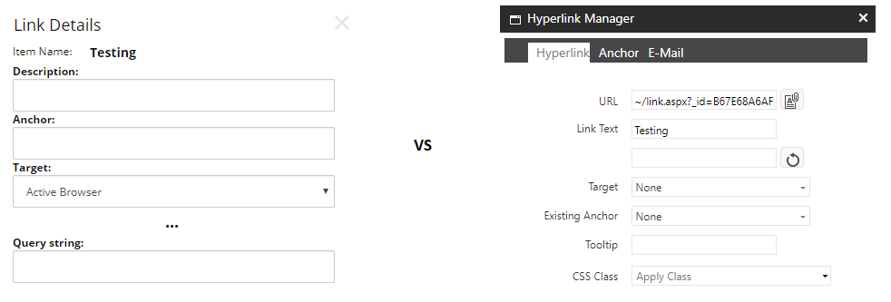

<!-- start:abstract -->

Sitecore has a pretty neat functionality for managing and rendering links. Most of the features are available to content authors via a few specialized components (*Rich Text Editor*, *Droplink*, *Droptree*, *General Link* and *General Link with Search* amongst others) and to developers via the *LinkManager* API. For obvious reasons, components focused in link management are easier to configure than those that serve a more general purpose. A clear example of this is the query string configuration in controls like the General Link vs the RTE (Rich Text Editor)…  

<!-- end:abstract -->

As shown below, in a General Link component the query string field is easily accessible via the editor window. Simply add the query string you want to use and the component will take care of the rest for you. Easy enough… But in the *RTE Hyperlink Manager*, things are a little different… there is no option for query string, so how can we do it?

On the left, the General Link window editor. On the right, the RTE hyperlink manager

Adding a query string to an external URL should not be a problem, just add it to the URL field and you should be good to go. Now, internal URLs are a different story. A closer look to the Hyperlink Manager reveals a very funny looking value in the URL field, this is because Sitecore uses IDs to link to internal items and later translates these IDs to get the final URLs, resolving aliases if needed. This clever mechanism allows content authors to rename and move things around without worrying about references between the items as these will be automatically resolved before rendering the final HTML.  

The URL of an internal item has the following structure: `~/link.aspx?_id=<ItemID>&amp;_z=z`. Looks pretty standard except for one tiny detail... the last argument in the query string makes no sense at all, at least not to me. Well, turns out the `_z=z` argument is just a quick hack used by Sitecore to delimit the *"item information"*, anything after this point is simply re-appended to the resolved URL, so we can add the query string right here.

So, this

**~/link.aspx?_id=693fc5a1-99be-47d6-b0b1-c2512a6345ff&amp;_z=z?value=xyz&amp;other=zyx**

Becomes 

**\<MySiteURL\>/\<MyPage\>?value=xyz&other=zyx**

Please notice the query string has to start with "?" for this to work. This is because Sitecore is not doing any formatting for us, so be careful when adding the query string to the URL…

Happy coding! 
