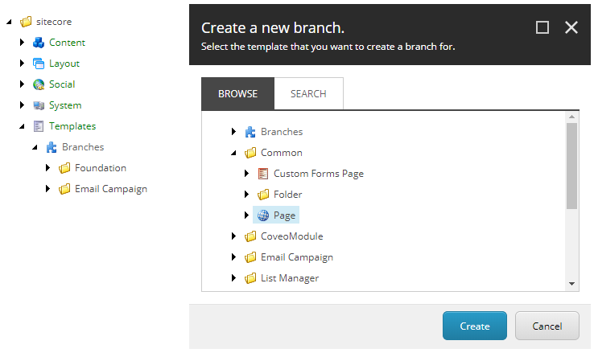
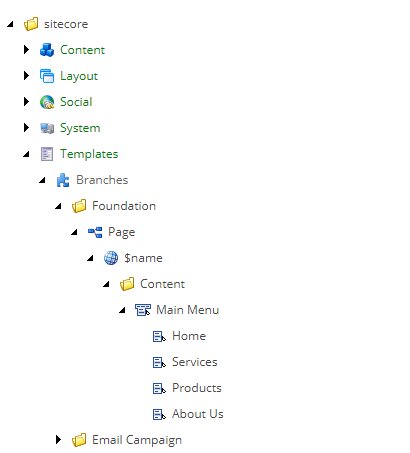
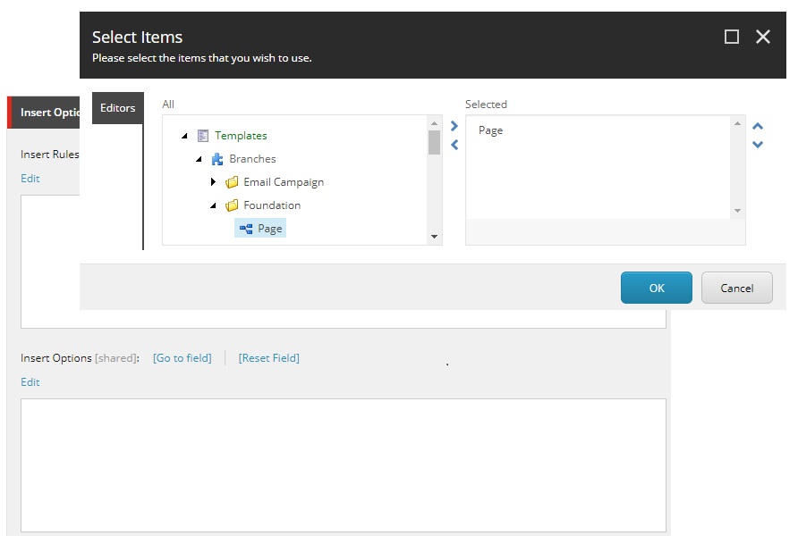
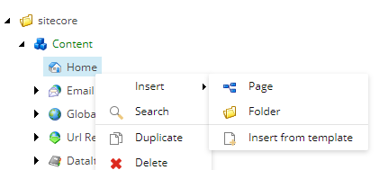
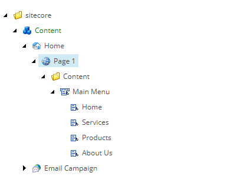

<!-- start:abstract -->

Wikipedia defines *Don't Repeat Yourself (DRY)* as 
[a principle aimed at reducing repetition of software patterns, replacing it with abstractions or using data normalization to avoid redundancy](https://en.wikipedia.org/wiki/Don%27t_repeat_yourself). Easy right? In fact, 
so easy that most developers apply the principle almost naturally and, in most 
cases, without even noticing they are using it.  

Have you ever considered how Sitecore uses it? Oh yes, Sitecore does use it and 
extensively.  

Don't believe me, keep reading...  

<!-- end:abstract -->

Sitecore uses *layouts* and *renderings/sublayouts* as mechanisms to organize 
and display information to the user. Because of their nature, they need to be 
highly flexible in order to be reusable. This flexibility wouldn't be possible 
without **templates**. Templates are just one of the many examples of the DRY 
principle in Sitecore.  

A template describes the general structure of an item and specifies the type of 
content and/or data fields that define such item. It can provide default values 
for some or all the fields, but doesn't necessarily force the author to use 
them, putting him/her in control of the content. To put it simply, a 
template is basically an abstraction of the content (its meaning and structure) 
and as any other abstraction it can be reused over and over again. A special 
type of template is the **Branch Template**. This beauty provides an extra 
level of abstraction that can save content authors an incredible amount of time, 
allowing them to focus on what matters... the **content**. 

A very common use case for branch templates is the definition of layouts in a 
site as all pages usually share the same global menu, footer, etc., but instead 
of hardcoding it in a big and ugly layout file, the branch template allows the 
content author to define the main structure using reusable components.

### Creating a branch template

Creating a branch template is as easy as right clicking the *Branches* node 
under */sitecore/Templates/* and selecting *New Branch* from the insert menu. 
This will bring up the *Create a new branch* dialog where the template to be 
extended can be selected. 

It is worth noting that branch templates don't really have a name of their own, 
they simply inherit the name of the template they are extending, so the item 
will look like a duplicate from a content editor point of view, except for one 
small detail discussed in the next section.

### Setting up a branch template

Setting up a branch template shouldn't be any different from creating a regular 
item, the only noticeable difference is the presence of the special item 
**$name**. This item acts as a placeholder that will ultimately be cloned, then 
customized to become the final item (be that a page, command, etc). Think of it 
as a prototype with predefined information and a few other fields that will be 
replaced by the final implementation.

Creating and setting up the template is just the first step, the branch template 
still needs to be made available to the content authors and the easiest way to 
do this is via the *Insert Options* of the item/items that will host it. 

### Using a branch template

Adding the branch template to the insert options of an item will put it in the 
insert menu of such item making it available to all content authors.

The end result should be pretty obvious, all the subitems and configurations 
included in the branch template will now be part of a real content item. 

### Conclusion

Always remember, Sitecore's ultimate goal is making things easy for the content 
authors, but Sitecore can't do it on its own, it's the architect/developer's 
task to find and use the tools to make it happen and branch templates just so 
happens to be the perfect example...

Happy coding!
