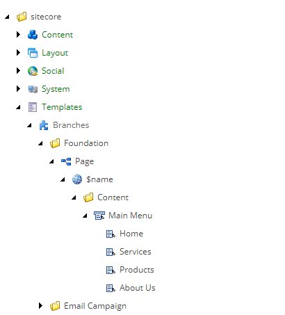
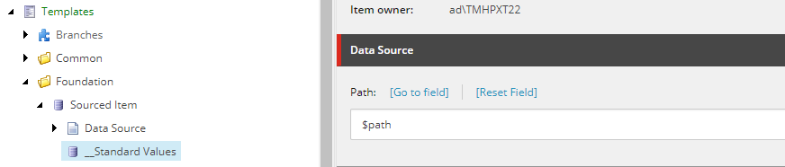
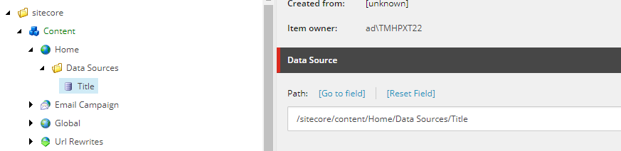

<!-- start:abstract -->

In a previous [blog post](https://www.weirdpattern.com/dont-repeat-yourself-with-sitecore-branch-templates) 
we talked about branch templates and how they make a content author's life a 
little bit easier by creating complex tree structures with a single click. But, 
unbeknownst to most, the post also introduced us to a new concept: tokens.  

<!-- end:abstract -->

Let's do a quick recap, when you create a new branch template you get a special 
item called **$name** underneath the branch template. For obvious reasons (we 
are talking about a template that will serve *n* number of items), we cannot 
hardcode the name of the item, instead we use a token that will be replaced with 
the real name of the item at runtime.  

### So, what is a token?

Tokens are Sitecore's answer to the question *how can I populate a field with a 
predefined value without hardcoding it in the standard values of the template?*. 
The technical geeky term for this is `interpolation`, but I won't bore you to 
death with the technicalities (but in case you are interested here is a more 
[detailed explanation](https://en.wikipedia.org/wiki/String_interpolation)).  

Out of the box Sitecore provides support for a finite number of tokens. These 
tokens do not require any configuration or setup, simply use one of the following 
in any field and you should be good to go.  

| Token        | Description                                                      |
| -----------: | ---------------------------------------------------------------- |
| $name        | Expands to the name of the new item entered by the user.         |
| $id          | Expands to the id of the new item.                               |
| $parentid    | Expands to the id of the parent of the new item.                 |
| $parentname  | Expands to the name of the parent of the new item.               |
| $date        | Expands to the system date in `yyyyMMdd` format.                 |
| $time        | Expands to the system time in `HHmmss` format.                   |
| $now         | Expands to the system date and time in `yyyyMMdd HHmmss` format. |

By convention, tokens are case insensitive, so it doesn't matter if you use 
`$ParentName` or `$PaRenTNaME`, Sitecore will know what to do with the token.  

### Wait... there is no token for the information I need, what now?  

OK, so there are two ways we can do this:  
1. Overriding the `Sitecore.Data.MasterVariablesReplacer` and patching the 
setting `MasterVariableReplacer` with the new class.  
2. Adding a new processor to the `expandInitialFieldValue` pipeline.  

Both are equally valid, but the second approach is my personal favorite as it's 
more in line with the Sitecore way of doing things (and, in my humble opinion, 
the first approach feels kind of *hacky*, especially because the 
`MasterVariablesReplacer` class has so many virtual methods that can be 
overridden that a novice developer wouldn't even know where to start).  

### Show me the code!  

I've seen many good and valid solutions online, some using the first approach, 
some using the second... but I wasn't really convinced by any of them, mainly 
because those using the first approach felt *hacky* and the others supported 
only one variable per processor. So I decided to come up with my own solution 
with openness and extensibility in mind.  

**The first step is creating the supporting classes and interfaces**.  
This set of classes and interfaces will provide the default structure and base 
implementation of all variable replacers (a.k.a. interpolators).  

First we start with the `IVariableReplacer` interface.  

`gist:2d25e86f7519778483c21cae5ed53c73#IVariableReplacer.cs`  

The interface defines two members:
- a `Variable` property that defines the name of the variable and aliases to be 
replaced (e.g. `$path`).  
- a `Replace(string, Item)` method that does the interpolation.  

Next is the base class for all replacers.  

`gist:2d25e86f7519778483c21cae5ed53c73#VariableReplacerBase.cs`  

The code speaks for itself, the only thing worth noting is the constructor that 
sets the `Variables` property with a values established by the inheriting class.  

**The second step is creating the processor**.  
This is easily achieved by extending the 
`Sitecore.Pipelines.ExpandInitialFieldValue.ExpandInitialFieldValueProcessor` 
class and overriding the `void Process(ExpandInitialFieldValueArgs)` method.  

`gist:2d25e86f7519778483c21cae5ed53c73#ReplaceCustomVariables.cs`  

This class has a property `Replacers` and a public method `AddVariableReplacer` 
that will be used in the next steps to create and store `IVariableReplacer` objects.  

**The third step is creating specific variable replacers**.  
For simplicity, I'm just adding a variable replacer that will expand the 
variable `$path` to the path of the item created by the user.  

`gist:2d25e86f7519778483c21cae5ed53c73#PathVariableReplacer.cs`  

But honestly the options are endless, anything you can access via the `Item` class 
is available to the variable replacer object... so go nuts...  

**The last step is tying it all together via a config patch file**.  
We are targeting the `expandInitialFieldValue` pipeline and because we want to be good 
citizens, we add our replacer after Sitecore's own replace variable processor, that 
way we can guarantee Sitecore's variable will be expanded before ours.  

`gist:2d25e86f7519778483c21cae5ed53c73#replace-custom-variables.config`  

### Show me an example, maybe?  

After a quick build and release, the variable will be available to use in the 
content editor, so go ahead and create a new template and use the `$path` variable 
in any field of the template's `__Standard Values` as shown below.  

  

Then go to any of your pages and add a new item with the newly created template. 
You should be able to see the end result in the editing panel.  

And that's a wrap people... I hope this helps you and your team!  

Happy Coding!  
