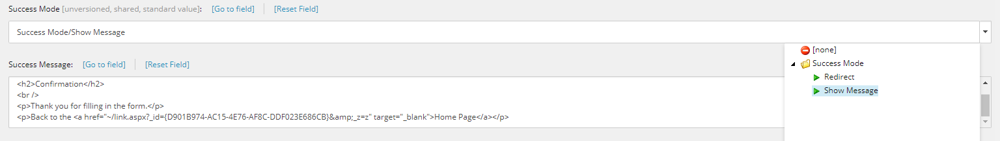
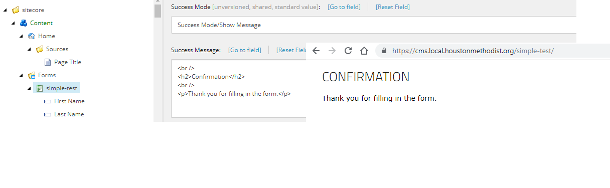
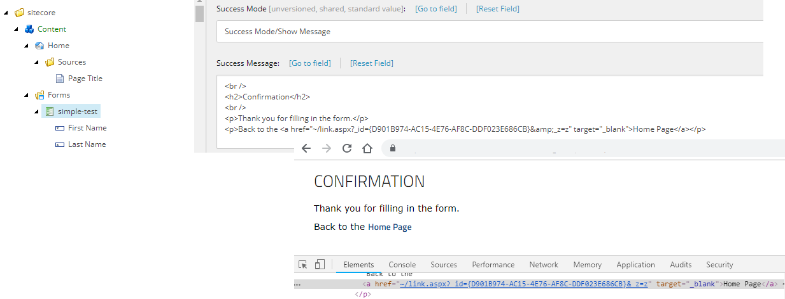
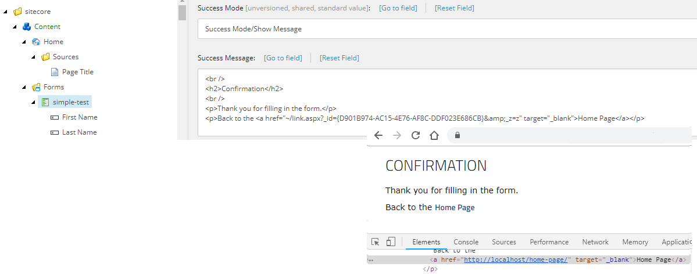

<!-- start:abstract -->

How many of you have opted for a redirection to a thank you page over a simple 
successful message with no refresh when dealing with *Web Forms for Marketers*? 
If you are doing this willingly, then fine, but if you are doing it because there 
are no styling options in the Success Message field, then keep reading... 
there are a few tricks you can use to supercharge this field.  

<!-- end:abstract -->

  

### The basics

Ok, let's get this out of the way so we can focus on what really matters...  

Even though the field is a *Multi-Line Text*, you can still use html tags inside it. 
All html tags work! Even the `css` and `script` tags can be used (although these 
are not recommended). The html will be honored and even the styles defined in the 
layout will be applied as expected.    

  

This alone should be enough to create a more or less decent thank you page, but 
because we are are using Sitecore we are going to take this a step further...  

### The problem: dynamic links

One neat Sitecore feature (and one of my personal favorites), is the ability to 
create `dynamic links` to other (internal) items via ids. This may not look like 
much, but believe me content authors love it because it gives them the flexibility 
to move things around without breaking previously established links.  

*Rich Text* fields support dynamic links out-of-the-box as the field use them 
extensively, unfortunately for us, the `Form` template doesn't use Rich Text 
fields (no idea why), but Multi-Line Text. Of course there is nothing stopping 
you from using dynamic links inside the field, the links will still render and 
work just fine, but they will look ugly and this can be confusing for both users 
and SEO bots.   

   

But, Sitecore doesn't close a door without opening a window...   

### The solution: pipelines

  

Web Forms for Marketers defines a `successAction` pipeline that gets triggered 
every time a form is successfully submitted. Attached to this pipeline is the 
`FormatSuccessMessage` processor whose purpose is formatting the SuccessMessage (duh!). 
Unfortunately, the default implementation of this processor is pretty basic (at least in 
older versions of WFFM), but at least it gives us a good extension point. So we can replace 
the default implementation with our own using the below patch config file.  

`gist:978da84415b4e0c6a87cd46656575898#z-replace-format-success-message.config`

As we said before, html in the SuccessMessage is already handled, so no need to 
do any sort of html/css/script processing (phew!), so our only concern at this 
point is the dynamic urls... easy fix if you have the right tool... 

Enter the `LinkManager` a.k.a. the heart of Sitecore's link management module. 
A simple call to `ExpandDynamicLinks` will do the trick.  

`gist:978da84415b4e0c6a87cd46656575898#FormatSuccessMessage.cs`

And the end result? Beautiful, user and SEO friendly urls. Nice!

Happy Coding!  
