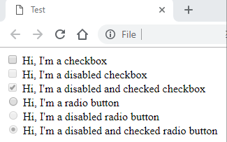

<!-- start:abstract -->

If you ask me to name one thing that I use everyday, I would probably say a 
browser and I'm pretty sure I'm not alone on this boat. For better or for worse, 
browsers have become part of our lives, we use them at work, we use them at home, 
we use them to read emails, news and even to chat and share our thoughts with the 
world. I dare say it's the one tool you cannot live without (unless of course you 
have been living under a rock for the last decade or so). 

Fortunately for us, we are not short on options: Chrome, Firefox, Edge, IE, 
Opera, Brave, and the [list](https://en.wikipedia.org/wiki/List_of_web_browsers) 
goes on. But it was due to this diversity of options that non other than the 
founder of the Internet, Sir Timothy John Berners-Lee, decided some 
[standards](https://www.w3.org) were needed. But standards are just guidelines 
that tell the browser the where and the what, but they don't tell the how. So 
the final implementation of a standard can (and almost 100% of the time, will) 
look different in one browser than it does in another.  

Input elements - especially the checkbox and the radio buttons - are a good 
example of the above, so in this article I'm going to show you how to standardize 
these two elements with nothing but *CSS*.  

<!-- end:abstract -->

### The problem in three acts

A developer writes some code like the one shown below.  

`gist:9e732f2e015f999b8da06409ddaab5ef#html.html`  

Act 1. The same developer opens Chrome and nods his head in agreement.  

Act 2. The same developer opens Firefox and scratches his head.  

Act 3. The same developer opens Edge and flips the table.  

  

What's the name of the play? ... ... ... 

Jokes aside, you see my point, right? It's exactly the same code, so why does it 
look different in all browsers? The implementation of the same standard is 
different, that's why... it's still a checkbox and a radio button in all three 
browsers, with the same enable/disable and checked/uncheched states... yet 
it's different. 

Nothing that can't be fixed with a few lines of good ol' CSS.  

### The cross browser solution

The solution I'm about to present should work in all browsers, but I only tested 
it in Chrome, Firefox, Edge and Internet Explorer 11 (number 2 on the 
[list](https://netmarketshare.com/browser-market-share.aspx) for those who 
can't believe I'm still using it) and it uses the standard *input + label* 
combination, so no real changes to the html or js required. Let's jump right to it.  

The first few steps are not really that interesting or difficult to understand, 
so I'm just showing the code and moving on.  

`gist:9e732f2e015f999b8da06409ddaab5ef#cross-browser-element.css`

Next, we use the `label::before` pseudo-element to create the new styled elements. 
There are three main blocks here: the core block that sets the common properties 
for both checkboxes and radio buttons; then two specific blocks targeting the 
checkbox or the radio buttons; and finally, a block with overrides specific to 
Internet Explorer 11.  

`gist:9e732f2e015f999b8da06409ddaab5ef#cross-browser-element-override.css`  

A couple of things worth noting.  
1. The code uses [Font Awesome](https://fontawesome.com) for the checkbox 
mark and the radio fillings, but this can be easily customized to use other 
fonts/unicodes/images/svgs.
2. Padding and margin values are defined in *em* units which allow the components 
to preserve the aspect-ratio when the font is increased. 
3. The transparent color is there for a reason: the mark (in checkboxes) and the 
filling (in radio buttons) are set as static values, so we need a way to hide 
them when the element is unchecked. This is how we do it.  

Now we need to customize the different states of the elements. The good news is 
checkboxes and radio buttons are quite similar, they both have the same 3 
well-known and defined states that we want to handle: *enable/disable*, 
*checked/unchecked* and *focused/not-focused*; so this should be pretty 
straight-forward.  

`gist:9e732f2e015f999b8da06409ddaab5ef#cross-browser-element-modifier.css`  

Just like last time, a couple of things worth noting:
1. Because the mark and the filling are static values and we are just hiding them 
using a transparent color, the only thing we need is, well... a color. Setting 
this property to `inherit` will guarantee that the mark or the filling will use 
the same color defined for the label, if you don't want this, then simply set it 
to the right color.
2. The focused state is interesting because each browser handles it differently, 
in other words, we have different implementations for the same standard as 
described in the intro. So instead of forcing a style upon the element, we will 
delegate this to the corresponding rendering engine by simple using a fallback + 
browser specific mechanism.  
2.1. Chromium-based browsers will use `-webkit-focus-ring-color`.  
2.2. Firefox will default to the browser specific block   
2.3. The rest will use the fallback *dotted* style.    

And the end result... consistent checkboxes and elements across all browsers!  

Happy Coding!
